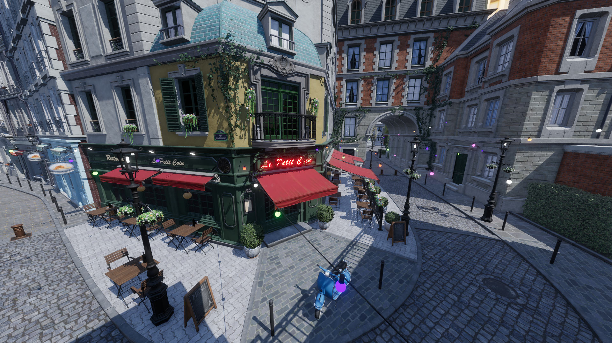
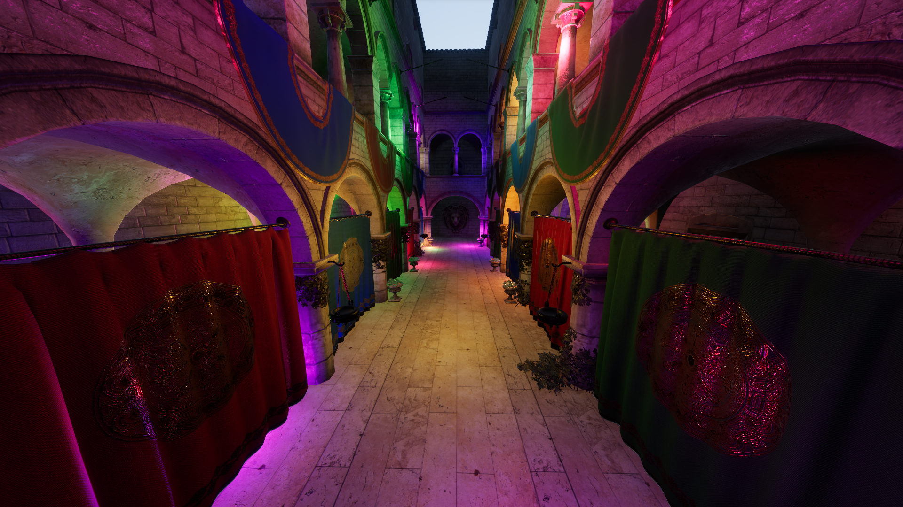
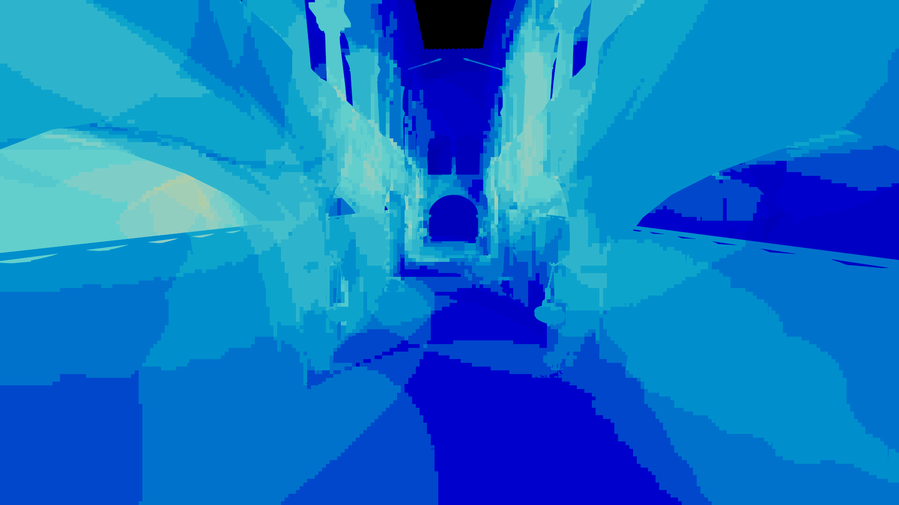
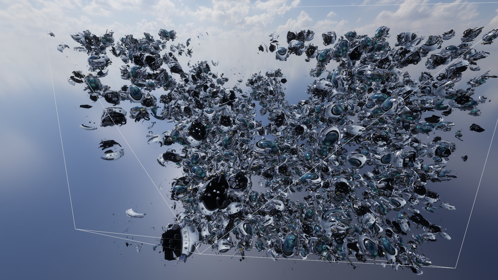

# Orbit

## About
A bindless gpu-driven toy vulkan renderer primarily made for testing out new rendering techniques.

## Features
- glTF scene loading
- Fully bindless resources
- Render Graph
- Physically Based Rendering & Image Based Lighting
- MSAA with alpha-to-coverage for alpha tested geometry
- Screen-space Ambient Occlusion
- Bloom
- Cascaded shadow mapping
- Clustered forward shading
- Meshlet based geometry pipeline
- Mesh shading
- GPU-driven culling:
  - Per-entity frustum and two-pass occlusion culling
  - Per-meshlet frustum, normal cone and two-pass occlusion culling

## Usage

```
Usage:
  orbit [flags] [options]

Flags:
  -h --help      Show this help message.
  -V --version   Show the application version.
  -f --file-log  Write logs to file

Options:
  -s --scene-path PATH   The gltf scene to be loaded at startup
  -e --envmap-path PATH  The environment map to be used as a skybox and IBL
```

## Controls

### Camera
- WASDEQ: Move camera
- Mouse right + drag: Rotate Camera
- Hold Ctrl: Slow down camera movement
- Hold Shift: Speed up camera movement

### Windows
- F1: Scene entity list & inspector
- F2: Render graph debugger and profiler
- F3: CPU profiling by [puffin](https://github.com/EmbarkStudios/puffin)
- F4: Settings
- F5: Camera debug settings & visualizations
- F6: Shadow debug settings & visualizations
- F7: Light cluster debug settings & visualizations
- F8: Gpu memory allocator visualization by [gpu-allocator](https://github.com/Traverse-Research/gpu-allocator)

### Render modes
Press associated number key
- 0: Normal shaded
- 1: Cascade visualization(if selected entity is a directional light)
- 2: Normals
- 3: PBR metallic value
- 4: PBR roughness value
- 5: Emissive value
- 6: Ambient occlusion
- 7: Overdraw visualization
- 8: Light Cluster visualization
- 9: Meshlet visualization

## Screenshots



